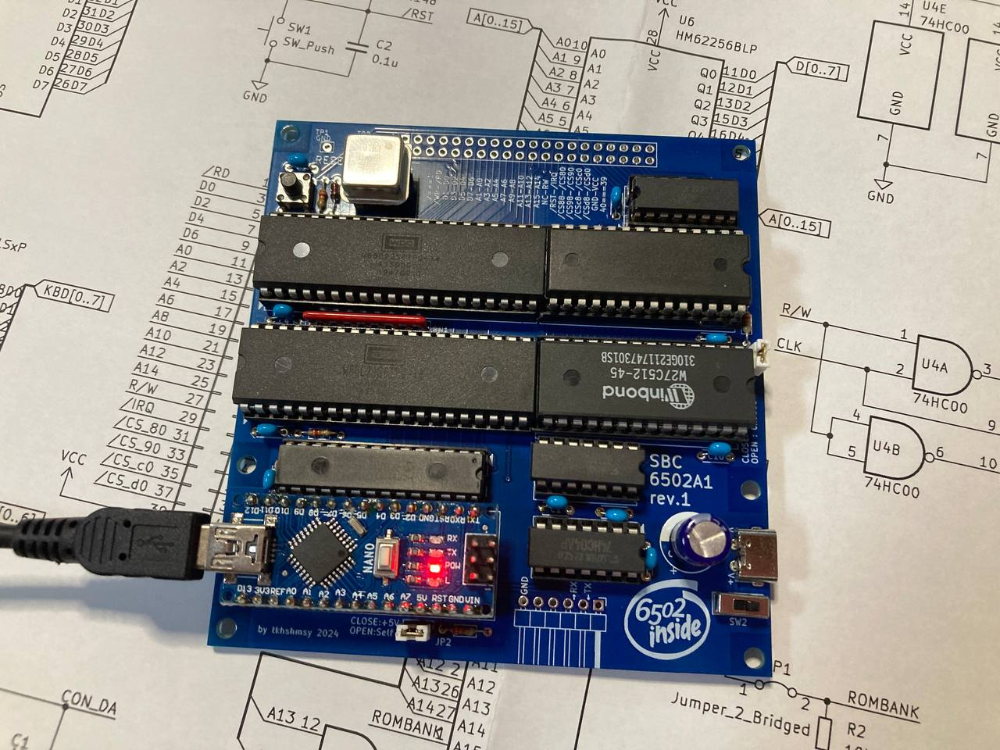
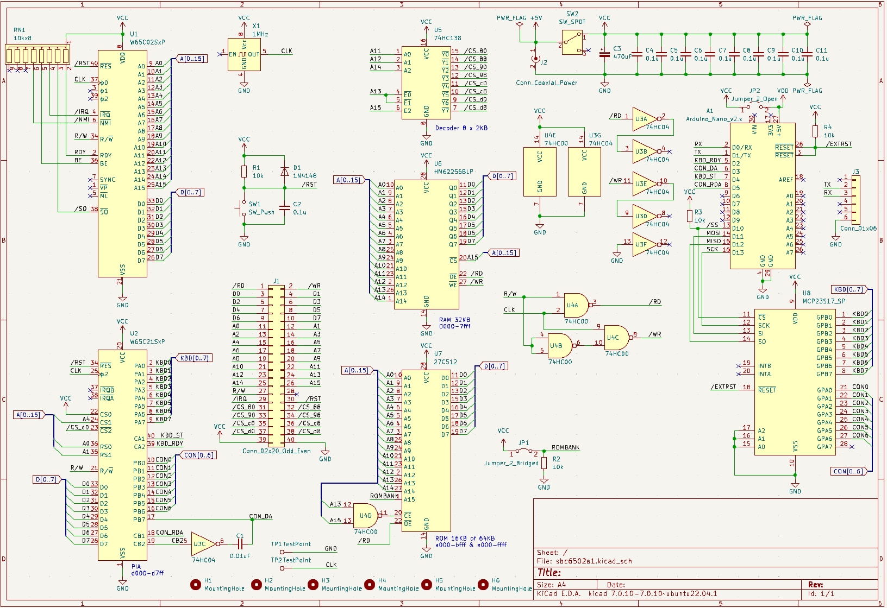
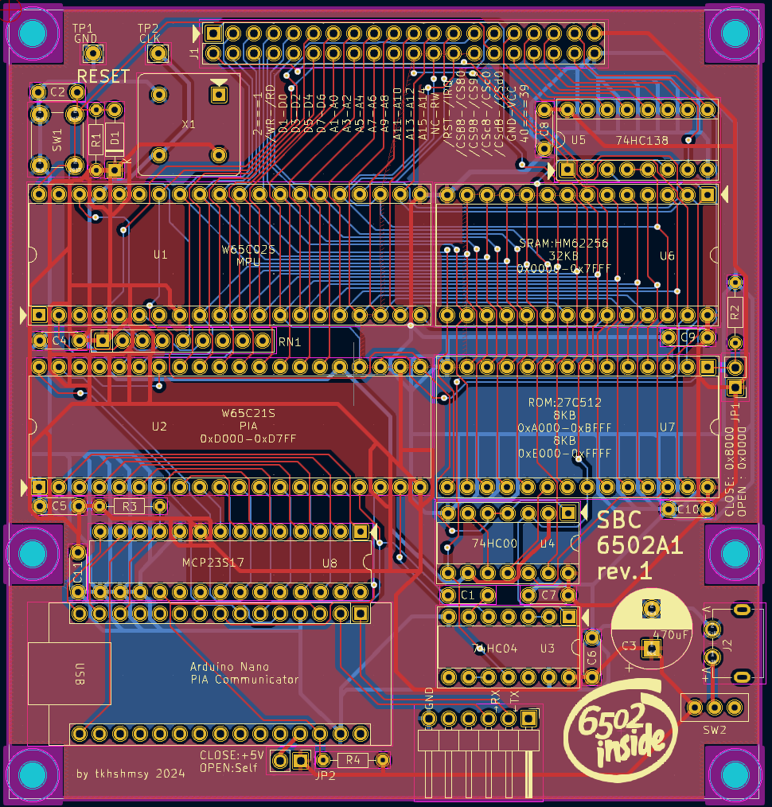

# sbc6502a1
Single Board Computer with 65C02, clone of Apple I

# Features
* Clone of Apple I.
  * similar but more ** grater ** projects are there.
    * [RC6502](https://github.com/tebl/RC6502-Apple-1-Replica) and [RC6502 Apple 1 SBC](https://github.com/tebl/RC6502-Apple-1-Replica/tree/master/RC6502%20Apple%201%20SBC)
    * [Apple 1 Mini](https://hackaday.io/project/26234/logs)
    * [L-Star](https://github.com/jacgoudsmit/L-Star/)
* Communicate with Host-PC via Serial.
  * using Arduino Nano as [PIA Communicator](https://github.com/jblang/pia_communicator)
* 32KB user RAM is available.
* ROM has 2 bank of each 8KB + 8KB.
  * it is enough for wozmon, Apple1-BASIC, OSI-BASIC and so on.
* Power supply +5VDC from Type-C or via Arduino Nano.

# PCB
## Schematics and Layout

## BOMs

| Ref | Name | Qty | Description | Package |
| --- | ---- | --- | ----------- | ------- |
| U1  | W65C02SxP | 1 | MPU 6502 | DIP40|
| U2  | W65C21SxP | 1 | PIA 6521 | DIP40|
| U3  | 74HC04    | 1 | | DIP14 |
| U4  | 74HC00    | 1 | | DIP14 |
| U5  | 74HC138   | 1 | | DIP16 |
| U6  | 62256     | 1 | SRAM 32Kx8 | DIP28 |
| U7  | 27C512    | 1 | ROM 64Kx8 | DIP28 |
| U8  | MCP23S17  | 1 | SPI/GPIO | DIP28/300mil|
| A1  | Arduino Nano | 1 | PIA Communicator | |
| X1  | 1.0 MHz     | 1 | Crystal OSC| DIP8 |
| C1  | 0.01uF-0.1uF | 1 | | |
| C2, C4-C11 | 0.1uF | 9 | | |
| C3  | 470uF    | 1 | | |
| D1  | 1N4148   | 1 | | DO35 |
| J1 | 2x20 Pin Header | 1 | Bus export| |
| J2 | USB Type-C Power| 1 | Power Supply| |
| J3 | 1x6 Pin Header | 1 | for Serial | |
| JP1 | 1x2 Pin Header | 1 | ROM bank select| |
| JP2 | 1x2 Pin Header | 1 | Arduino power select| |
| R1-R4 | 10K | 4 | | |
| RN1 | 10Kx8 | 1 | | |
| SW1 | Push Button | 1 | Reset SW| |
| SW2 | Slide Switch | 1 | Power SW| |
| TP1,TP2 | Test Pin | 2 | | |

## Memory Map

### System
| Address | Size | Name | Note |
| ----- | ---- | ---- | ---- |
|0x0000 - 0x7FFF| 32KB | RAM | |
|0x8000 - 0x87FF| 2KB | (N.C.) | /CS80 |
|0x8800 - 0x8FFF| 2KB | (N.C.) | /CS88 |
|0x9000 - 0x97FF| 2KB | (N.C.) | /CS90 |
|0x9800 - 0x9FFF| 2KB | (N.C.) | /CS98 |
|0xA000 - 0xBFFF| 8KB | ROM | mapped from 0x2000 or 0xA000|
|0xC000 - 0xC7FF| 2KB | (N.C.) | /CSc0 |
|0xC800 - 0xCFFF| 2KB | (N.C.) | /CSc8 |
|0xD000 - 0xD7FF| 2KB | PIA | assigned to 0xD010 |
|0xD800 - 0xDFFF| 2KB | (N.C.) | /CSd8 |
|0xE000 - 0xFFFF| 8KB | ROM | mapped from 0x6000 or 0xE000|

### ROM (27C512 64KB)
| Address | Bank | Note |
| ------- | ---- | ---- |
| 0x0000 - 0x1FFF |Bank0 (JP1 open)| no use |
| 0x2000 - 0x3FFF ||8KB, mapped to 0xA000|
| 0x4000 - 0x5FFF || no use |
| 0x6000 - 0x7FFF ||8KB, mapped to 0xE000|
| 0x8000 - 0x9FFF |Bank1 (JP1 close)| no use |
| 0xA000 - 0xBFFF ||8KB, mapped to 0xA000|
| 0xC000 - 0xDFFF || no use |
| 0xE000 - 0xFFFF ||8KB, mapped to 0xE000|

# License
* MIT
  * only for PCB
  * firmwares are NOT included.

# Author
* [tkhshmsy@gmail.com](tkhshmsy@gmail.com)

